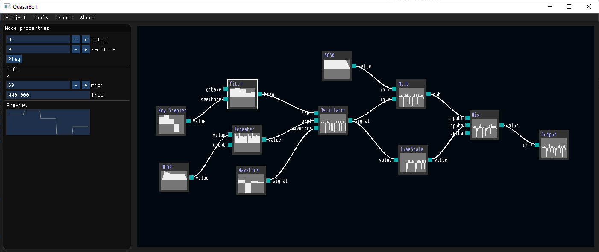
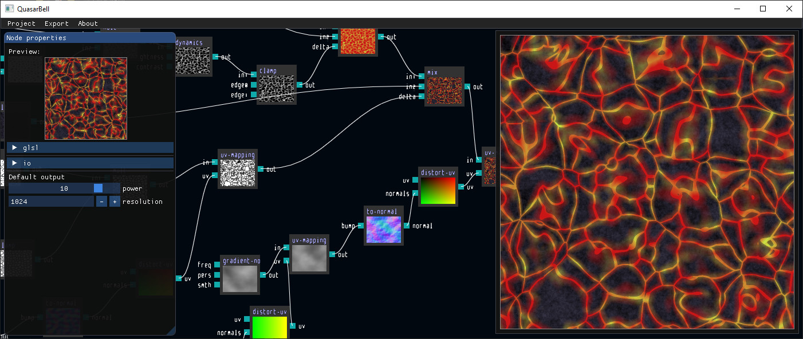
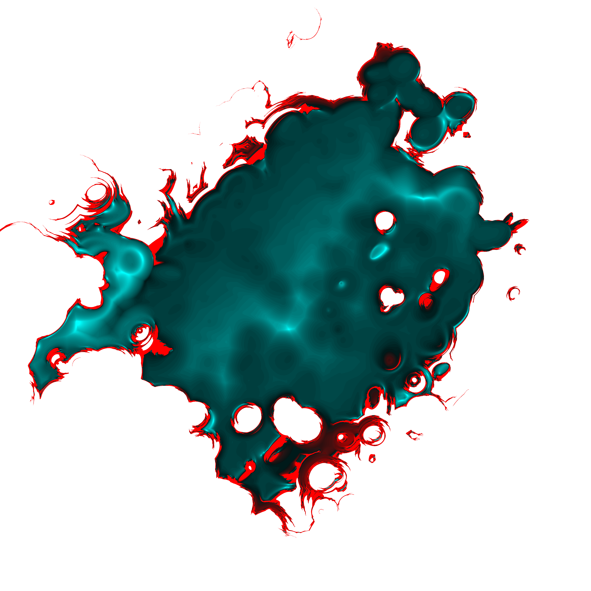
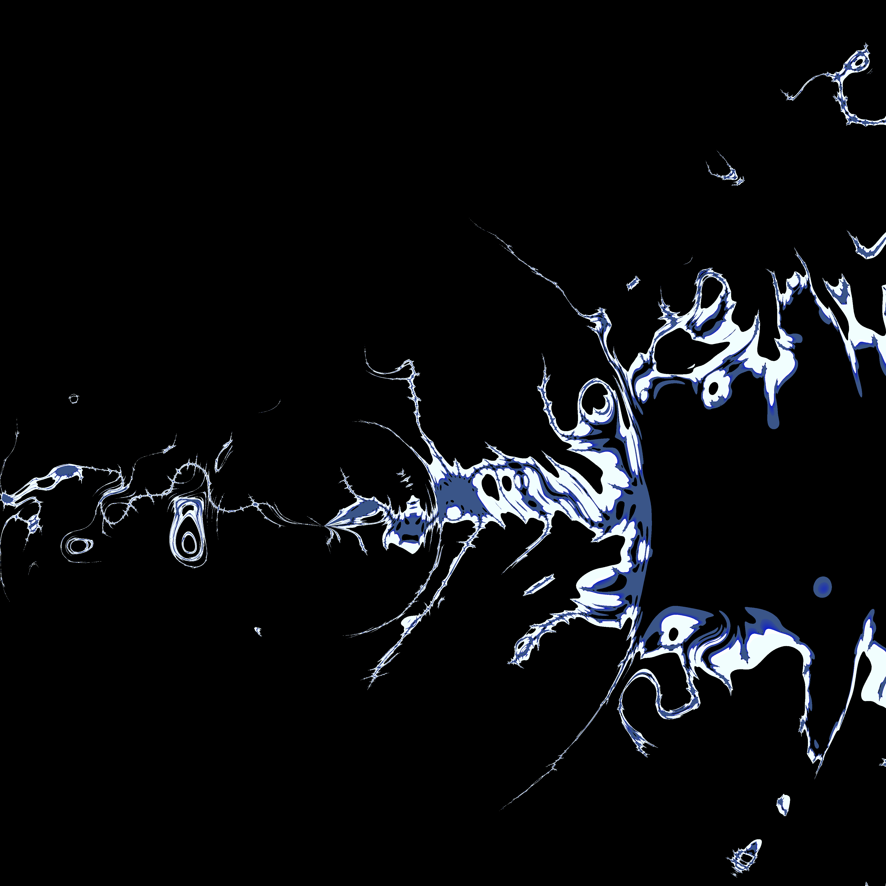
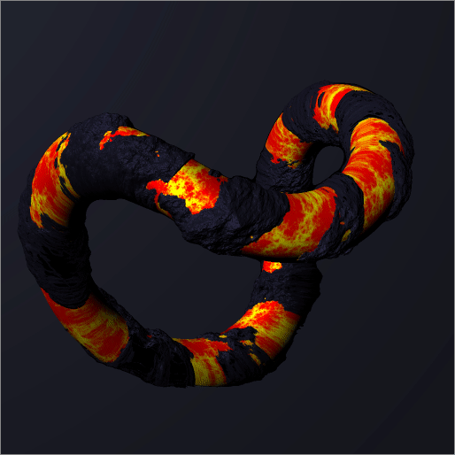

# QuasarBell
QuasarBell is a small sfx, texture and geometry nodal editor made with openal + imgui

### Preview





### Some rendering results





### Dependencies
- OpenAL (SDK 1.1 under Windows; 1.20 under Linux)
- GLFW3 3.3.2
- OpenGL 3.3 must be supported

### Building from source
Use CMake to generate a makefile. For example with MSYS2 from project root folder:
```bash
mkdir build
cd build
cmake -G "MSYS Makefiles" ..
make -j8
```
